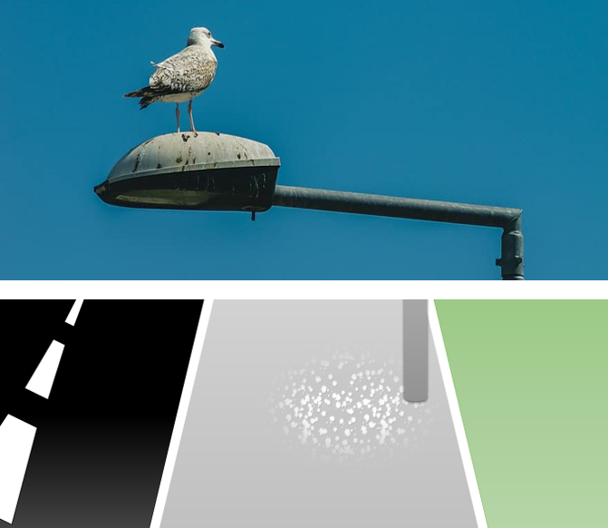

Metodologia Cuantitativa II
========================================================
author: Joaquin Bahamondes, Ph.D.
date: Universidad Catolica del Norte
autosize: true

First Slide
========================================================

For more details on authoring R presentations please visit <https://support.rstudio.com/hc/en-us/articles/200486468>.

- Bullet 1
- Bullet 2
- Bullet 3

Slide With Code
========================================================


Slide With Plot
========================================================


Slide With Plot
========================================================


```
processing file: Clase_2_Descriptivo.Rpres
Quitting from lines 30-38 (Clase_2_Descriptivo.Rpres) 
Error:   You're passing a function as global data.
  Have you misspelled the `data` argument in `ggplot()`
Backtrace:
     x
  1. +-knitr::knit(...)
  2. | \-knitr:::process_file(text, output)
  3. |   +-base::withCallingHandlers(...)
  4. |   +-knitr:::process_group(group)
  5. |   \-knitr:::process_group.block(group)
  6. |     \-knitr:::call_block(x)
  7. |       \-knitr:::block_exec(params)
  8. |         +-knitr:::in_dir(...)
  9. |         \-knitr:::evaluate(...)
 10. |           \-evaluate::evaluate(...)
 11. |             \-evaluate:::evaluate_call(...)
 12. |               +-evaluate:::timing_fn(...)
 13. |               +-base:::handle(...)
 14. |               +-base::withCallingHandlers(...)
 15. |               +-base::withVisible(eval(expr, envir, enclos))
 16. |               \-base::eval(expr, envir, enclos)
 17. |                 \-base::eval(expr, envir, enclos)
 18. +-ggplot2::ggplot(df, aes(x = value))
 19. \-ggplot2:::ggplot.function(df, aes(x = value))
Ejecución interrumpida
```
